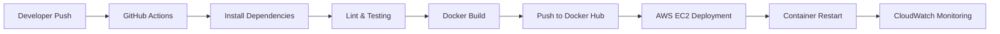

# INAI Worlds — AI Engineer Internship

> **AI Engineer Intern — INAI Worlds (Remote)**
> Worked on cloud deployment infrastructure, DevOps automation, monitoring systems, and production-grade CI/CD pipelines for AI applications.
> Resume reference: 

---

# 📌 Overview

During my internship at INAI Worlds, I worked on deploying and managing production-ready AI systems in a cloud-native environment. My responsibilities focused on backend infrastructure, DevOps automation, CI/CD engineering, Dockerized deployments, AWS cloud services, and system monitoring.

The internship provided hands-on experience in designing scalable deployment pipelines and building reliable infrastructure for AI-powered applications running in production environments.

The work involved:

* Dockerized application deployment
* Automated CI/CD pipelines
* AWS infrastructure management
* Cloud monitoring and observability
* Secure secret handling
* Production-grade deployment workflows
* Automated testing and validation

---

# 🎯 Core Responsibilities

## 1. AWS Infrastructure Deployment

Designed and deployed cloud infrastructure using multiple AWS services including:

* Amazon EC2
* AWS S3
* Elastic Load Balancer
* Route53 / DNS configurations
* Security Groups
* CloudWatch monitoring
* RDS database connectivity

The infrastructure was configured for scalable and secure AI application hosting.

---

## 2. Production CI/CD Pipeline Engineering

Built complete GitHub Actions-based CI/CD pipelines automating:

* Dependency installation
* Linting and code quality checks
* Unit testing
* Docker image building
* Container registry pushes
* Remote EC2 deployment
* Automated container restarts

The pipeline enabled zero-manual deployment workflows directly from GitHub commits.

---

# 🏗️ CI/CD Architecture

---

# ⚙️ Deployment Workflow

## Phase 1 — Source Validation

* Triggered GitHub Actions on:

  * `push`
  * `pull_request`
* Installed dependencies
* Verified Python environment
* Performed static analysis using Flake8

---

## Phase 2 — Automated Testing

Implemented automated validation pipelines using:

* Pytest
* Environment-specific testing
* In-memory database configurations
* Isolated testing environments

Testing pipelines ensured deployment safety before production rollout.

---

## Phase 3 — Docker Build & Registry Management

Built multi-version Docker deployment workflows:

* `latest` image tagging
* Commit SHA-based immutable tagging
* Automated Docker Hub publishing

This enabled:

* Rollbacks
* Version traceability
* Stable production releases

---

## Phase 4 — Automated EC2 Deployment

Configured GitHub Actions SSH deployment pipelines that:

* Connected securely to EC2 instances
* Pulled latest Docker images
* Restarted containers automatically
* Mounted runtime configuration files
* Managed persistent environment variables

Deployment automation significantly reduced manual operational overhead.

---

# 🔐 Security Engineering

## Secret Management

Implemented secure credential handling using:

* GitHub Secrets
* Environment variable injection
* Isolated runtime configuration files

Sensitive credentials such as:

* API keys
* Database URLs
* Docker credentials
* AWS access keys

were never exposed inside repositories.

---

## Infrastructure Security

Configured:

* AWS Security Groups
* Controlled network exposure
* Secure SSH deployment access
* Read-only mounted certificates
* Isolated runtime containers

---

# 📊 Monitoring & Observability

Built monitoring systems using AWS CloudWatch to track:

* CPU utilization
* Application latency
* Container uptime
* Infrastructure health

Configured automated alarms and threshold-based monitoring for production reliability.

Example monitored conditions:

* CPU usage above threshold
* High response latency
* Container failures

---

# 🐳 Docker & Containerization

Designed Dockerized runtime environments for consistent deployments across environments.

Key deployment capabilities:

* Immutable container deployments
* Runtime environment injection
* Persistent restart policies
* Simplified rollback workflows
* Cross-environment consistency

---

# 🧪 Testing & Validation Pipeline

Implemented automated quality assurance workflows including:

* Linting with Flake8
* Pytest-based unit tests
* Dependency validation
* Build verification
* Runtime environment simulation

The CI system prevented unstable builds from reaching production.

---

# 🛠️ Tech Stack

| Category               | Technologies                 |
| ---------------------- | ---------------------------- |
| **Cloud**              | AWS EC2, S3, CloudWatch, RDS |
| **DevOps**             | GitHub Actions, Docker       |
| **Languages**          | Python                       |
| **Monitoring**         | CloudWatch                   |
| **Testing**            | Pytest, Flake8               |
| **Deployment**         | SSH Automation               |
| **Container Registry** | Docker Hub                   |

---

# 🚀 Key Engineering Learnings

## Production Deployment Workflows

Learned how real-world systems transition from:

* source code
* to validated builds
* to containerized deployment
* to monitored production infrastructure

---

## CI/CD Reliability

Understood how automated pipelines:

* reduce operational risk,
* improve deployment speed,
* and enforce consistent engineering quality.

---

## Infrastructure Automation

Gained hands-on experience in:

* infrastructure configuration,
* runtime orchestration,
* secure deployment engineering,
* and monitoring-driven system reliability.

---

# 💡 Impact

This internship significantly strengthened my understanding of:

* Cloud-native AI infrastructure
* DevOps automation
* Production backend deployment
* Monitoring and observability
* Secure software delivery pipelines
* Scalable infrastructure management

It also gave practical exposure to how AI products are deployed, monitored, and maintained in real-world production environments.
