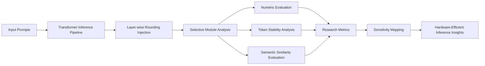

# TCS Research Internship

> **Research Internship — TCS Research × Intel Collaboration**
> Focused on numerical robustness, floating-point behavior, and hardware-efficient inference for large language models.

---

# 📌 Overview

During this research internship, I worked on advanced numerical optimization and inference-efficiency research for Transformer-based Large Language Models (LLMs). The work explored how floating-point rounding behavior impacts Transformer inference stability, semantic consistency, and autoregressive generation quality under reduced precision computation.

The research was conducted in collaboration with researchers working on hardware-efficient AI systems and focused on building experimentally reproducible evaluation pipelines for analyzing numerical sensitivity across Transformer architectures.

The internship emphasized:

* Large-scale Transformer inference analysis
* Numerical robustness in BF16 precision
* Layer-wise sensitivity evaluation
* Hardware-aware AI optimization
* Autoregressive error accumulation analysis
* Research reproducibility and experimentation

---

# 🎯 Research Focus

The primary objective of the research was to investigate how different floating-point rounding behaviors influence the inference quality of Transformer models operating under reduced precision.

The project studied:

* Numerical drift propagation during inference
* Sensitivity of different Transformer components
* Stability of autoregressive decoding
* Semantic degradation caused by rounding perturbations
* Trade-offs between efficiency and inference correctness

Rather than modifying model architectures or retraining models, the work focused entirely on controlled inference-time experimentation.

---

# 🧠 Key Contributions

## 1. Built Layer-Wise Numerical Sensitivity Evaluation Pipelines

Designed experimental pipelines to evaluate the impact of floating-point perturbations across multiple Transformer submodules including:

* Attention projections
* Normalization layers
* Feed-forward networks
* Residual pathways

The system enabled isolated experimentation on specific architectural regions while preserving deterministic inference conditions.

---

## 2. Developed Controlled Rounding Injection Frameworks

Implemented forward-pass numerical perturbation mechanisms using PyTorch hooks to inject custom rounding behaviors during inference without modifying model weights.

The framework supported:

* Deterministic rounding experiments
* Scaled truncation policies
* Stochastic perturbation strategies
* Layer-specific activation manipulation
* Comparative numerical evaluation

---

## 3. Performed Autoregressive Stability Analysis

Built evaluation workflows to study cumulative numerical error propagation during long-sequence autoregressive generation.

The analysis focused on:

* KV-cache reuse stability
* Long-horizon semantic drift
* Token-level divergence growth
* Generation degradation under repeated inference reuse

---

## 4. Designed Multi-Level Evaluation Metrics

Implemented comprehensive evaluation systems measuring:

* Numerical divergence
* Probability distribution shifts
* Token prediction instability
* Semantic similarity degradation

The evaluation stack included:

* Logit-space comparison metrics
* KL divergence analysis
* Token overlap metrics
* Sentence embedding similarity evaluation

---

# 🏗️ Research Architecture

---

# ⚙️ Experimental Workflow

## Phase 1 — Baseline Stability Validation

* Verified deterministic inference behavior
* Established reproducible evaluation pipelines
* Ensured identical outputs under controlled conditions

## Phase 2 — Global Numerical Stress Testing

* Applied perturbations across entire Transformer pipelines
* Measured semantic degradation and numerical instability

## Phase 3 — Layer-Wise Sensitivity Analysis

* Isolated Transformer components
* Identified numerically robust and fragile regions

## Phase 4 — Autoregressive Error Accumulation

* Evaluated long-sequence inference stability
* Studied cumulative degradation patterns during decoding

---

# 📊 Technical Areas Explored

## Transformer Internals

* Attention mechanisms
* QKV projections
* Feed-forward networks
* Residual pathways
* RMS normalization

## Numerical Computing

* BF16 precision analysis
* Floating-point rounding behavior
* Numerical drift propagation
* Stability evaluation

## LLM Inference Systems

* Deterministic decoding
* KV-cache reuse
* Autoregressive generation
* Inference optimization

## Evaluation & Analysis

* Semantic similarity scoring
* Distribution divergence analysis
* Token stability evaluation
* Experimental reproducibility

---

# 🛠️ Tech Stack

| Category            | Technologies                      |
| ------------------- | --------------------------------- |
| **Frameworks**      | PyTorch, HuggingFace Transformers |
| **Languages**       | Python                            |
| **Model Systems**   | Transformer-based LLMs            |
| **Evaluation**      | SBERT, Statistical Metrics        |
| **Experimentation** | BF16 Precision Inference          |
| **Research Tools**  | Jupyter, Scientific Python Stack  |

---

# 🔬 Engineering Challenges

## Numerical Stability Isolation

Ensuring all observed behavior originated strictly from controlled numerical perturbations rather than randomness, sampling noise, or architectural changes.

## Deterministic Reproducibility

Maintaining fully reproducible inference pipelines under repeated evaluation runs.

## Long-Horizon Error Accumulation

Studying how microscopic numerical perturbations propagate across autoregressive decoding steps.

## Semantic vs Numerical Divergence

Understanding the disconnect between early numerical instability and delayed semantic degradation.

---

# 📈 Research Outcomes

The research demonstrated that:

* Numerical robustness varies significantly across Transformer components
* Certain architectural regions are substantially more tolerant to reduced-precision perturbations
* Autoregressive inference amplifies cumulative numerical instability
* Layer-aware optimization strategies are more effective than globally applied approximations
* Hardware-efficient inference requires both numerical and architectural awareness

---

# 🚀 Skills Developed

* Transformer systems research
* LLM inference optimization
* Numerical computing
* AI systems evaluation
* Hardware-aware AI engineering
* Experimental reproducibility
* Research-oriented software engineering
* Scientific benchmarking

---

# 💡 Key Learning

This internship provided deep exposure to the intersection of:

* AI systems engineering,
* numerical computing,
* hardware optimization,
* and large-scale Transformer inference.

The experience strengthened my understanding of how low-level numerical operations influence high-level semantic behavior in modern LLM systems and how research-driven engineering can contribute to more efficient and scalable AI infrastructure.

---

# 📄 Research Context

This work was conducted as part of a collaborative AI systems research initiative involving industry research teams focused on efficient Transformer inference and numerical robustness evaluation.

Sensitive implementation details, proprietary infrastructure information, and internal experimental configurations have been intentionally abstracted in this public documentation.
